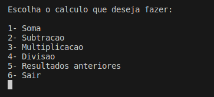
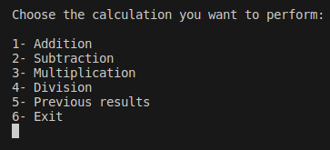

# Basic Calculator (Via Terminal)/ Calculadora Basica (Via Terminal)

Introduce/Introdução

- Has two languages suport | - Suporte para duas linguas

- Calculator functions/Funções da calculadora
  - Addition/Soma
  - Subtraction/Subtração
  - Multiplication/Multiplicação
  - Division/Divisão
  - Register of results/Resultados anteriores

- To use:                 -Para usar:
  - Open terminal           - Abra o terminal
  - Find the folder         - Encontre a pasta
  - ./build_US              - ./build_BR

# Versão PT-BR
 

 # US version
 
